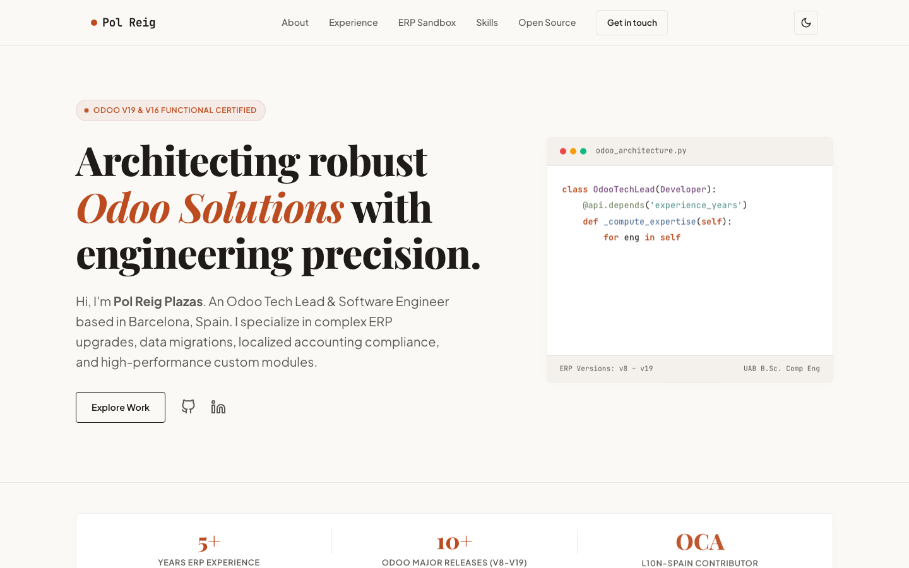
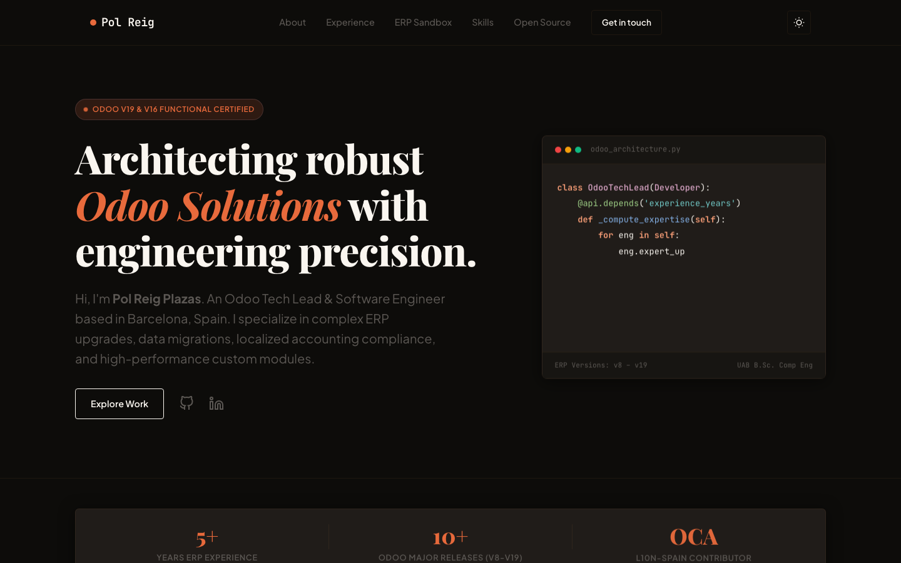

# Pol Reig Plazas — Portfolio

[](https://polreig.com)
[](./LICENSE)

Personal site of **Pol Reig Plazas** — Odoo Tech Lead & Software Engineer (Barcelona).

**[polreig.com](https://polreig.com)** · [LinkedIn](https://linkedin.com/in/pol-reig-plazas-30020a20a)

Static single-page portfolio (HTML / CSS / JS, no build). Experience, skills, OCA notes, and an interactive ERP sandbox.

| Light | Dark |
|:-----:|:----:|
| [](https://polreig.com) | [](https://polreig.com) |

## Run

```bash
git clone https://github.com/reigpol/portfolio.git
cd portfolio
python3 -m http.server 8080   # http://localhost:8080
```

Or open `index.html` in a browser.

## Stack

| File | Role |
|------|------|
| `index.html` | Content & structure |
| `style.css` | Layout, light/dark theme |
| `app.js` | Theme, menu, sandbox, skills filter, contact |

Hosted on Vercel → [polreig.com](https://polreig.com).

## Contact

| | |
|---|---|
| **Web** | [polreig.com](https://polreig.com) |
| **Email** | [polreigdev@gmail.com](mailto:polreigdev@gmail.com) |
| **LinkedIn** | [Pol Reig Plazas](https://linkedin.com/in/pol-reig-plazas-30020a20a) |
| **GitHub (personal)** | [github.com/reigpol](https://github.com/reigpol) |
| **GitHub (work)** | [github.com/polqubiq](https://github.com/polqubiq) |

## License

[MIT](./LICENSE) © 2026 Pol Reig Plazas
